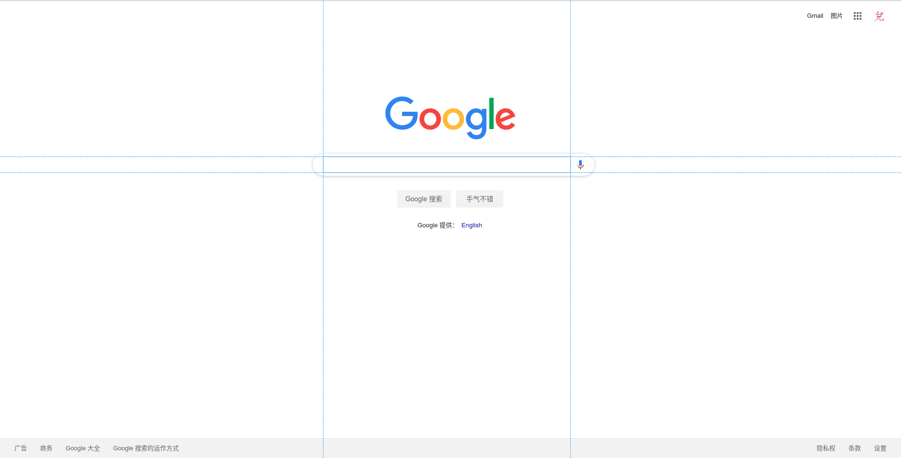
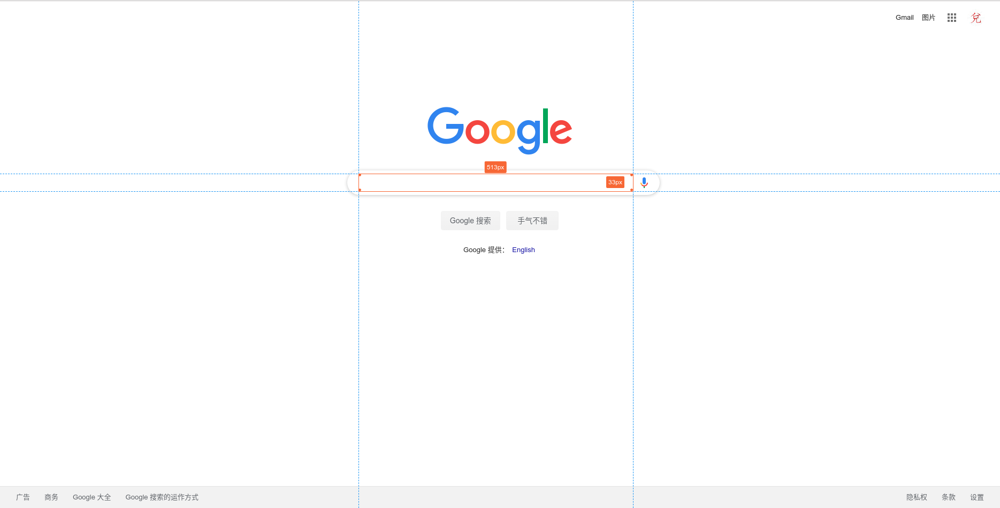
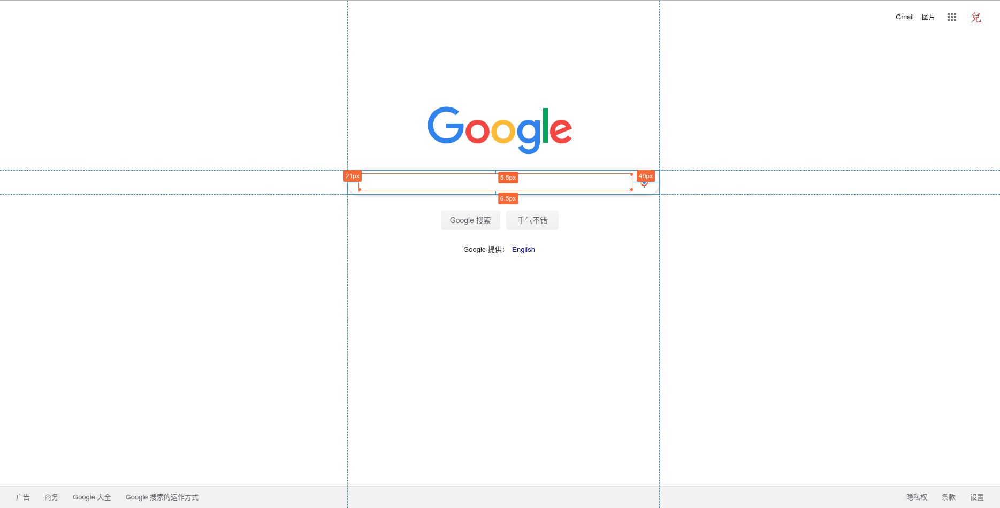
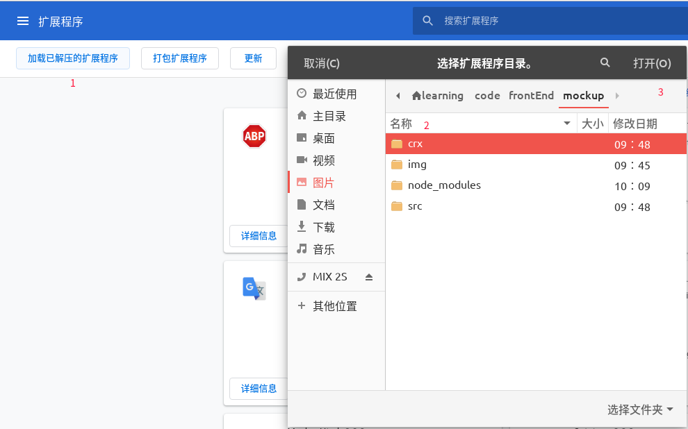

# mockup

一个 [Chrome 插件](https://chrome.google.com/webstore/detail/mockuphtml/ignpmjjbhkdldpknghggddehdakmkimd)，可以标记页面元素距离。

## 使用方式

鼠标移动到页面任意元素，当前鼠标移动到的元素会有蓝色边框，如下图：



此时鼠标单击该元素或者按下 `Ctrl` 键盘（有些元素绑定了点击事件，使用 `Ctrl` 键可以避免）将会选中该元素，效果如下图：



此时鼠标再移动到任意元素，将会标示出选中元素和鼠标 `hover` 元素之间的距离，如下图：



## 开发

### 目录结构

```
.
├── crx //插件打包目录
│   ├── background.js
│   ├── imgs
│   │   ├── alipay.jpg
│   │   ├── me128.png
│   │   ├── me16.png
│   │   └── me48.png
│   ├── manifest.json
│   └── popup
│       ├── popup.html
│       └── popup.js
├── img //文档截图
│   ├── Chrome加载扩展程序.png
│   ├── 对比.png
│   ├── 鼠标经过.png
│   └── 选中.png
├── index.html
├── LICENSE
├── package.json
├── package-lock.json
├── postcss.config.js
├── README.md
├── src //源码目录
│   ├── css 样式文件
│   │   ├── style.css
│   │   └── style.less
│   └── ts ts 文件
│       ├── const.ts
│       ├── crx.ts //webpack 打包入口
│       ├── guidLine.ts
│       ├── line.ts
│       ├── mockup.ts
│       ├── model.ts
│       ├── rectangle.ts
│       ├── seletedRectangle.ts
│       ├── style.ts
│       ├── trick.ts
│       └── utils.ts
├── tsconfig.json
└── webpack.config.js
```

### 运行

```
npm install
npm run start
```

然后 浏览器打开 [localhost:4200](http://localhost:4200)

### 在 Chrome 中调试插件

地址栏输入 `chrome://extensions/` 跳到插件页面。点击 `加载已解压的扩展程序`，选择 `crx` 目录。



### 打包成 .crx 格式

点击 `打包扩展程序` 按钮，按照页面提示完成即可。
