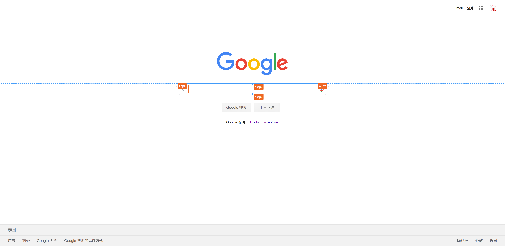

# HTML 元素标记器

一个 [Chrome 插件](https://chrome.google.com/webstore/detail/mockuphtml/ignpmjjbhkdldpknghggddehdakmkimd)，增强调试工具的元素选择功能，能够标记元素边框和大小，标记选择的元素间间距。

## 使用方式

鼠标移动到页面任意元素，移动到的元素会有蓝色边框，如下图：


此时鼠标单击该元素或者按下 `Ctrl` 键（有些元素绑定了点击事件，使用 `Ctrl` 键可以避免该情况下选不到元素）将会选中该元素，效果如下图：


此时鼠标再移动到除其之外的任意元素，将会标示出选中元素和鼠标经过元素之间的距离，如下图：



## 开发

### 目录结构

```
.
├── crx // 插件打包目录
|   ├── _locales // i18n
|   │   ├── en
|   │   │   └── messages.json
|   │   ├── zh_CN
|   │   │   └── messages.json
│   ├── imgs
│   │   ├── alipay.jpg
│   │   ├── logo16.png
│   │   └── logo48.png
│   │   ├── logo128.png
│   ├── popup
│   |   ├── popup.html
│   |   └── popup.js
│   ├── background.js
│   └── manifest.json
├── img // 文档截图
│   ├── diff.png
│   ├── hover.png
│   ├── load.png
│   ├── load_en.png
│   ├── pack.png
│   ├── pack_en.png
│   └── select.png
├── src
│   ├── css
│   │   ├── style.css
│   │   └── style.less
│   └── ts
│       ├── const.ts
│       ├── crx.ts // Webpack 打包入口
│       ├── guidLine.ts
│       ├── line.ts
│       ├── mockup.ts
│       ├── model.ts
│       ├── rectangle.ts
│       ├── seletedRectangle.ts
│       ├── style.ts
│       ├── trick.ts
│       └── utils.ts
├── crx.crx
├── index.html
├── LICENSE
├── package.json
├── package-lock.json
├── postcss.config.js
├── README.md
├── README_EN.md
├── tsconfig.json
└── webpack.config.js
```

### 运行

```
npm install
npm run start
```

然后浏览器打开 [localhost:4200](http://localhost:4200)。

### 在 Chrome 中调试插件

地址栏输入 `chrome://extensions/` 跳到插件页面。点击 `加载已解压的扩展程序`，选择 `crx` 目录。


### 打包成 .crx 格式

点击 `打包扩展程序` 按钮，按照页面提示完成即可。


