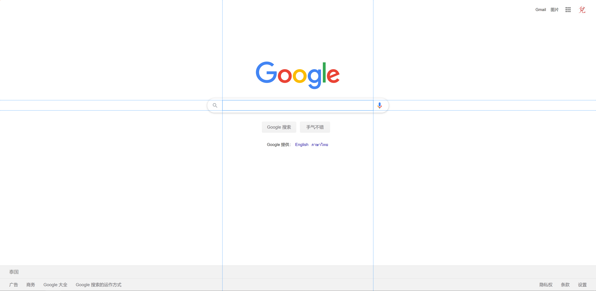
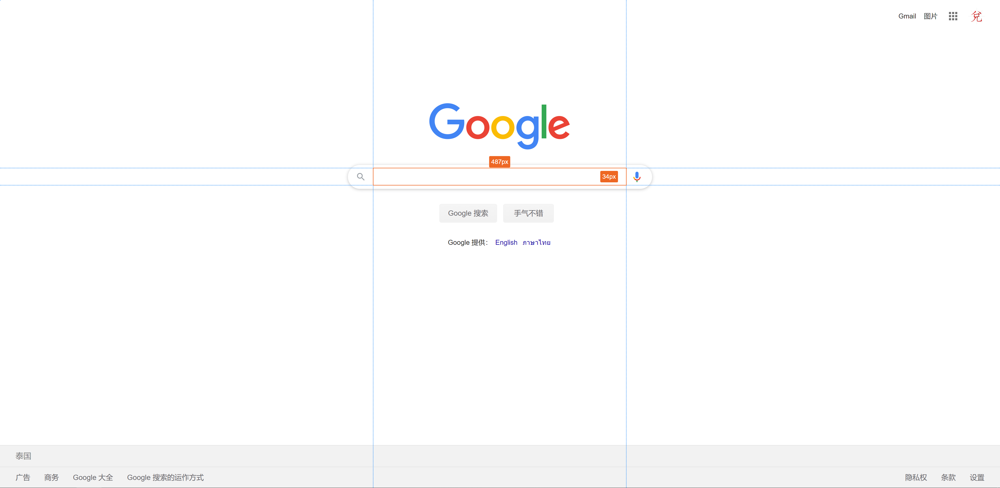
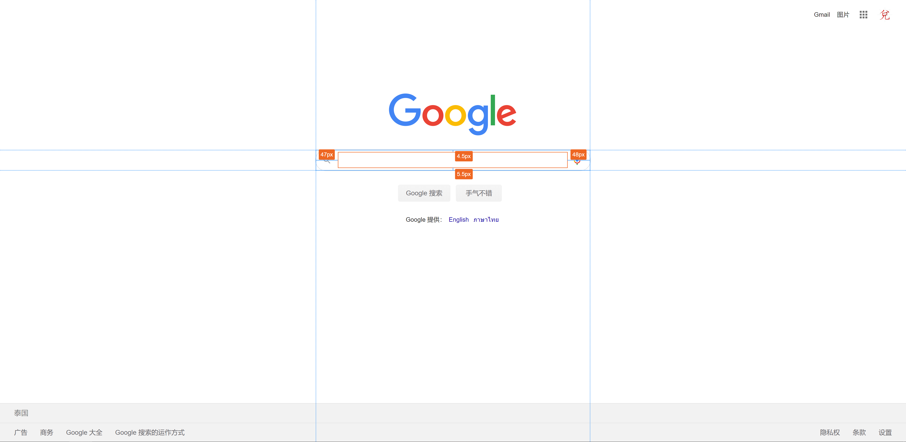
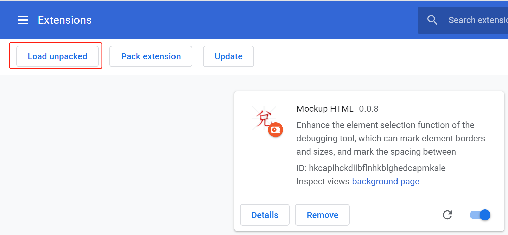
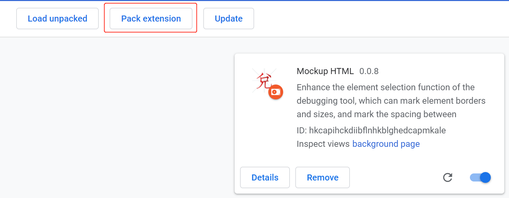

# Mockup HTML

A [Chrome Extendstion](https://chrome.google.com/webstore/detail/mockuphtml/ignpmjjbhkdldpknghggddehdakmkimd)，that enhances the element selection function of the debugging tool, can mark element borders and sizes, and mark the spacing between selected elements.

## How to use

Move the mouse to any element on the page, and the moved element will have a blue border, as shown below:



At this time, clicking the element with the mouse or pressing the `Ctrl` key (some elements are bound to click events, use the `Ctrl` key to prevent the element from being selected in this case) will select the element, and the effect is as follows:



At this time, when the mouse moves to any element other than it, the distance between the selected element and the element passed by the mouse will be marked, as shown below:



## Development

### Directory Structure

```
.
├── crx // Extendstion packaging directory
|   ├── _locales // i18n
|   │   ├── en
|   │   │   └── messages.json
|   │   ├── zh_CN
|   │   │   └── messages.json
│   ├── imgs
│   │   ├── alipay.jpg
│   │   ├── logo16.png
│   │   └── logo48.png
│   │   ├── logo128.png
│   ├── popup
│   |   ├── popup.html
│   |   └── popup.js
│   ├── background.js
│   └── manifest.json
├── img // Document screenshot
│   ├── load.png
│   ├── load_en.png
│   ├── pack.png
│   ├── pack_en.png
│   ├── diff.png
│   ├── hover.png
│   └── select.png
├── src
│   ├── css
│   │   ├── style.css
│   │   └── style.less
│   └── ts
│       ├── const.ts
│       ├── crx.ts // Webpack entry
│       ├── guidLine.ts
│       ├── line.ts
│       ├── mockup.ts
│       ├── model.ts
│       ├── rectangle.ts
│       ├── seletedRectangle.ts
│       ├── style.ts
│       ├── trick.ts
│       └── utils.ts
├── crx.crx
├── index.html
├── LICENSE
├── package.json
├── package-lock.json
├── postcss.config.js
├── README.md
├── README_EN.md
├── tsconfig.json
└── webpack.config.js
```

### Running

```
npm install
npm run start
```

Then opens [localhost:4200](http://localhost:4200)

### Debug In Chrome

Enter `chrome://extensions/` in the address bar to jump to the plugin page. Click `Load unpacked` and select the `crx` directory.



### Packaged in .crx format

Click the `Pack extension` button and follow the instructions on the page to complete.


